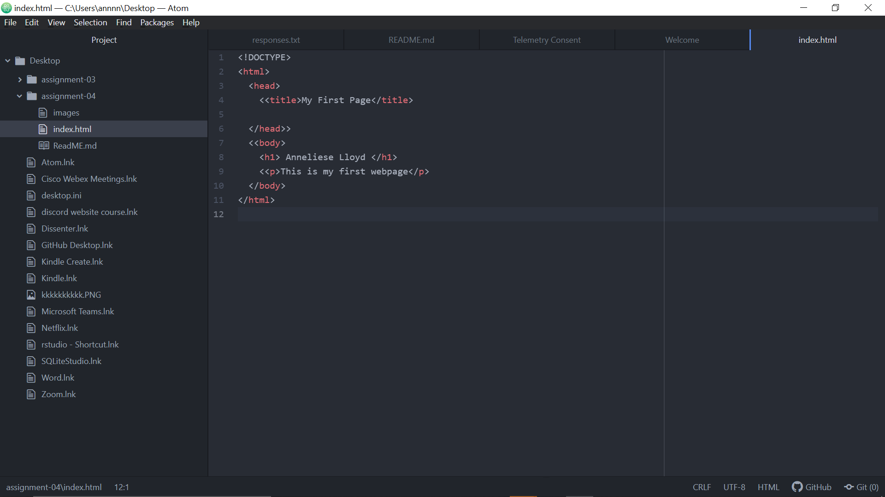

1. Browsers function with the goal of retrieving data. The browser engine communicates between the user interface and the rendering engine or external servers. The browser engine retrieves the requested data from the URL.  Once the data is received, the rendering engine converts the file into an interactive file. The rendering engine does this by reading the HTML and then constructs a DOM (Document object model) and then the render tree layouts the webpage.

  1a. Currently, I mainly use Chrome as my browser to surf
2. A markup language is used to describe how data is represented on a web document and the structure of the web page.

2a. One of the most common markup languages for development is HTML, otherwise known as hypertext markup language.
3. 
