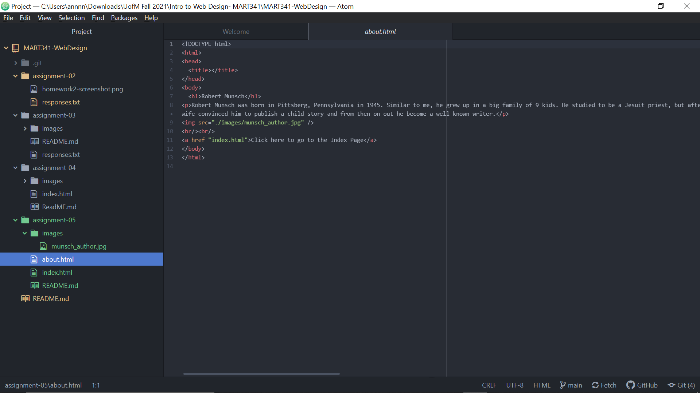

1. Using The Wayback Machine, I went to a snapshot from 2001 of Ford.com. I choose the snapshot created on May 3, 2001 because it was the day after I was born. The website looked horrible, with car listings everywhere on the page, and none of the images were displaying ( I think its because there file locations were changed or taken down). The Ford website has changed dramatically, with the most current one having easier navigation for users to find the type of car they want. The current website is a lot easier to use and more appealing.
2. So far, I have had a good experience with these last few lessons. I learned a lot, such as html code, and the main elements. What is difficult is remembering exactly the code, but I know i'll know it by heart in a few weeks. What has been easy is working with the repository and the file tree hierarchy.

